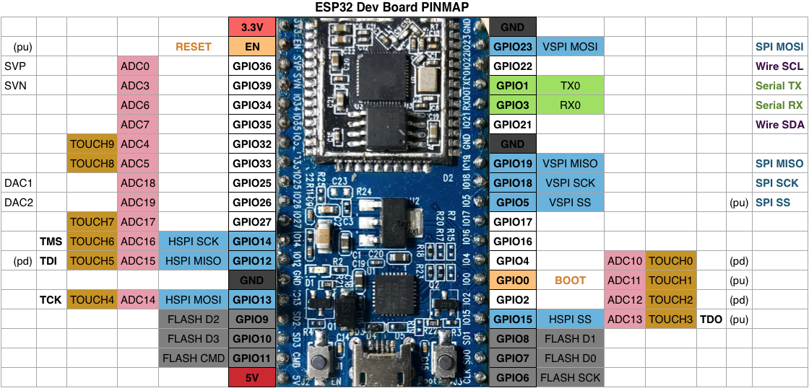

# ESP32
Comece a usar o ESP32

## Conteúdo
- [Sobre a ESP32](#sobre-ESP32)
- [Instruções de instalação](#instruções-de-instalação)
- [Descobertas](#descobertas)
- [ESP32Dev Board PINAGEM](#esp32dev-board-pinagem)

## Sobre a ESP32

O ESP32 é uma placa que custa menos de R$ 20 com ótimas vantagens em relação às placas IoT similares no mercado.

Esta placa possui um microprocessador dual processado, enquanto um processador manipula a comunicação, o outro é responsável pelo controle de E/S, por exemplo. Este recurso irá evitar alguns problemas que acontecem com o ESP8266, onde uma única CPU precisa parar de controlar E / S quando manipula a comunicação. Além disso, o ESP32 integrou WIFI, BLUETOOTH, DAC, vários ADC (e não apenas um como ocorre no ESP8266), sensores de toque capacitivos, etc. E a boa notícia é que o consumo de energia é quase o mesmo que no ESP8266.

Abaixo de um gráfico que pode nos mostrar suas principais características e diferenças quando comparado com ESP8266:

Vamos indicar as suas principais características em mais detalhes:

### Principais Características:

- 240 MHz dual core Tensilica LX6 microcontroller with 600 DMIPS
- Integrated 520 KB SRAM
- Integrated 802.11 b/g/n HT40 Wi-Fi transceiver, baseband, stack and LwIP
- Integrated dual mode Bluetooth (classic and BLE)
- 16 MB flash, memory-mapped to the CPU code space
- 3V to 3.6V operating voltage
- 40°C to +125°C operating temperature
- Onboard PCB antenna / IPEX connector for external antenna

### Sensores:

- Ultra-low noise analog amplifier
- Hall sensor
- 10x capacitive touch interfaces
- 32 kHz crystal oscillator
- 34 x GPIO:

- 3 x UARTs, including hardware flow control
- 3 x SPI
- 2 x I2S
- 18 x ADC input channels
- 2 x DAC
- 2 x I2C
- PWM/timer input/output available on every GPIO pin
- OpenOCD debug interface with 32 kB TRAX buffer
- SDIO master/slave 50 MHz
- Supports external SPI flash up to 16 MB
- SD-card interface support

### Segurança:

- WEP, WPA/WPA2 PSK/Enterprise
- Hardware accelerated encryption: AES/SHA2/Elliptical Curve Cryptography/RSA-4096

### Performance:

- Supports sniffer, Station, SoftAP and Wi-Fi direct mode
- Max data rate of 150 Mbps@11n HT40, 72 Mbps@11n HT20, 54 Mbps@11g, and 11 Mbps@11b
- Maximum transmit power of 19.5 dBm@11b, 16.5 dBm@11g, 15.5 dBm@11n
- Minimum receiver sensitivity of -97 dBm
- 135 Mbps UDP sustained throughput
- 5 μA power consumption in Deep-sleep

## Instruções de Instalação

1. Download e Instale a [Arduino IDE](https://www.arduino.cc/en/Main/Software). 
2. Abra a página [Espressif ESP32](https://github.com/espressif/arduino-esp32/blob/master/README.md#installation-instructions "Instalation Instructions ") e siga as instruções para o seu sistema operacional. 
3. Instale o [driver](https://www.silabs.com/developers/usb-to-uart-bridge-vcp-drivers) para garantir que a placa se comunique corretamente com o seu PC
4. Conecte a placa ao seu PC usando um cabo micro-usb
5. Selecione a placa no caminho “Tools/Board ESP32 Dev Module" dentro da IDE do Arduino.
6. Altere a Upload Speed para 115,200 bauds!
7. Selecione a porta COM correspondente.

## Descobertas
Vou compartilhar as descobertas e desafios que eu encontrar na pasta abaixo, pode ser que algo seja útil para o seu projeto:

+ [Descobertas](descobertas/)

## ESP32Dev Board PINAGEM

## Dicas

A vezes para programar a  ESP32 via serial você deve manter o em nível baixo durante o processo.
## Links Úteis

[Arduino core for the ESP32](https://github.com/espressif/arduino-esp32)

[HT-Deko](http://ht-deko.com/arduino/esp-wroom-32.html)

[ESP32](http://esp32.net/)

[Livro ESP-32](https://leanpub.com/kolban-ESP32)

[MGO Tec](https://www.mgo-tec.com/tag/esp32)
